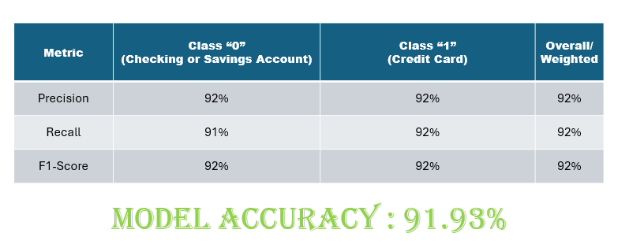

# ML_CFPB_Complaint_Classification
<b>Group Members : Anirudh Bhamidipati, kanha Baidya, Yashesh Darji and Bonyshree Bose</b>

## Objective

The Consumer Financial Protection Bureau is a 21st century agency that implements and enforces Federal consumer financial law and ensures that markets for consumer financial products are fair, transparent, and competitive.

Each week thousands of consumer complaints about financial products and services are sent to respective companies for response. Data from those complaints helps CFPB understand the financial marketplace and protect consumers. This ever-growing CFPB Complaint Database
is publicly avaiable and offers a rich resource for understanding consumer experiences in the financial marketplace.

Our project will provide prediction platform leveraging machine learning to analyze the extensive Consumer Financial Protection Bureau (CFPB) Complaint Database, a publicly
available resource exceeding 4.9 GB in size.

The platform will utilize the machine learning models to classify consumer complaints text into these categories: Debt collection, Consumer Loan, Mortgage, Credit card, Credit reporting, Student loan, Bank account or service, Payday loan, Money transfers, Other financial service, Prepaid card.

## Specifications

CFPB publish complaints after the company responds or after 15 days, whichever comes first. Here's the information provided in the published report. 

<table>
    <tr>
        <th>Field name</th>
        <th>Description</th>
    </tr>
    <tr>
        <th>Date received</th>	
        <th>The date the CFPB received the complaint.</th>
    </tr>
    <tr>
        <th>Product	</th>
        <th>The type of product the consumer identified in the complaint. For example, “Checking or savings account” or “Student loan.”</th>
    </tr>
    <tr>
        <th>Sub-product	</th>
        <th>The type of sub-product the consumer identified in the complaint. For example, “Checking account” or “Private student loan.”</th>
    </tr>
    <tr>
        <th>Issue	</th>
        <th>The issue the consumer identified in the complaint. For example, “Managing an account” or “Struggling to repay your loan.”</th>
    </tr>
    <tr>
        <th>Sub-issue	</th>
        <th>The sub-issue the consumer identified in the complaint. For example, “Deposits and withdrawals” or “Problem lowering your monthly payments.”</th>
    </tr>
    <tr>
        <th>Consumer complaint narrative	</th>
        <th>Consumer complaint narrative is the consumer-submitted description of “what happened” from the complaint. Consumers must opt-in to share their narrative. We will not publish the narrative unless the consumer consents, and consumers can opt-out at any time. The CFPB takes reasonable steps to scrub personal information from each complaint that could be used to identify the consumer.</th>
    </tr>
    <tr>
        <th>Company public response	</th>
        <th>The company’s optional, public-facing response to a consumer’s complaint. Companies can choose to select a response from a pre-set list of options that will be posted on the public database. For example, “Company believes complaint is the result of an isolated error.”</th>
    </tr>
    <tr>
        <th>Company	</th>
        <th>The complaint is about this company. For example, “ABC Bank.”</th>
    </tr>
    <tr>
        <th>State	</th>
        <th>The state of the mailing address provided by the consumer.</th>
    </tr>
    <tr>
        <th>ZIP code	</th>
        <th>The mailing ZIP code provided by the consumer. This field may: i) include the first five digits of a ZIP code; ii) include the first three digits of a ZIP code (if the consumer consented to publication of their complaint narrative); or iii) be blank (if ZIP codes have been submitted with non-numeric values, if there are less than 20,000 people in a given ZIP code, or if the complaint has an address outside of the United States).</th>
    </tr>
    <tr>
        <th>Tags	</th>
        <th>Data that supports easier searching and sorting of complaints submitted by or on behalf of consumers. For example, complaints where the submitter reports the age of the consumer as 62 years or older are tagged “Older American.” Complaints submitted by or on behalf of a servicemember or the spouse or dependent of a servicemember are tagged “Servicemember.” Servicemember includes anyone who is active duty, National Guard, or Reservist, as well as anyone who previously served and is a veteran or retiree.</th>
    </tr>
    <tr>
        <th>Consumer consent provided?	</th>
        <th>Identifies whether the consumer opted in to publish their complaint narrative. We do not publish the narrative unless the consumer consents, and consumers can opt-out at any time.</th>
    </tr>
    <tr>
        <th>Submitted via	</th>
        <th>How the complaint was submitted to the CFPB. For example, “Web” or “Phone.”</th>
    </tr>
    <tr>
        <th>Date sent to company	</th>
        <th> The date the CFPB sent the complaint to the company.</th>
    </tr>
    <tr>
        <th>Company response to consumer	</th>
        <th>This is how the company responded. For example, “Closed with explanation.”</th>
    </tr>
    <tr>
        <th>Timely response?</th>	
        <th>Whether the company gave a timely response. For example, “Yes” or “No.”</th>
    </tr>
    <tr>
        <th>Consumer disputed?	</th>
        <th>Whether the consumer disputed the company’s response.</th>
    </tr>
    <tr>
        <th>Complaint ID	</th>
        <th>The unique identification number for a complaint.</th>
    </tr>
</table>	

## Pre-requisites 
<ol>
<li>Pull the project in to your local machine

<li> Download the Consumer Complaint Dataset
<ul>
    <li>Go to CFPB site (consumerfinance.gov), click on the 'Data and Research' option and select 'Consumer Complaint Database'.</li>
    <li>Select the Date Range(3m), Read 'Only complaints with narratives' and click on Export Data.</li>
    <li>On the Export Complaints pop up, Select 'CSV' for exported file type and Select 'Filtered dataset' to download entries that matches the filtering criteria.</li>
</ul>

<li>Download pre-trained word vectors - Head over to https://nlp.stanford.edu/projects/glove/. Then underneath “Download pre-trained word vectors,” you can choose any of the four options for different sizes or training datasets. Here we are using glove.6B.zip file. Place the downloaded file inside {project_folder}/Resources/Glove and unzip it here.

<li> Steps to input the Consumer Complaint Data
<ul>
<li>The Consumer Complaint Data downloaded in the above step should be copied to this location Resources\MonthData\ that's inside the Project Folder(ML_CFPB_Complaint_Classification).
</ul>
</ol>

## Technologies 

This repository includes a wide range of technologies and tools used in various machine learning and data science projects:

- **Programming Languages:** Python
- **Libraries/Frameworks:**
  - Machine Learning: scikit-learn, TensorFlow, PyTorch, Keras
  - NLP: Natural Language Toolkit (NLTK), SpaCy, neuralcoref
  - SpaCy Models to download - en_core_web_sm and en
  - MatplotLib and SeaBorn for the graphs
- **Tools & Platforms:** 
  - Google Colab, Jupyter Notebooks
  - Git and GitHub for version control

## Execution
Execute the notebooks inside ML_CFPB_Complaint_Classification\data_preprocessing folder in the sequence given below:-
* data_analysis
* model_data
* supervised_ML
* deep_learning

These notebooks would save the model inside the Resources\ModelData folder which can be used for further perform prediction testing.
To perform prediction testing run these files supervised_ML_test and deep_learning_test

## 📚 Resources and References

- **Official Python Documentation**: [Python.org](https://docs.python.org/3/)
- **Scikit-learn User Guide**: [Scikit-learn.org](https://scikit-learn.org/stable/user_guide.html)
- **Keras Documentation**: [Keras.io](https://keras.io/)
- **TensorFlow Documentation**: [Tensorflow.org](https://www.tensorflow.org/)
- **PyTorch Documentation**: [Pytorch.org](https://pytorch.org/docs/)

## Workflow

## Data Challenges and Preprocessing Techniques

* Imbalanced Data:

        Problem: Class imbalance where some classes are underrepresented can cause the model to be biased towards the majority class.

        Solution: Techniques such as SMOTE (Synthetic Minority Over-sampling Technique), undersampling, or using class weights in the model can help balance the data.
* Large Dataset

* Preprocessing Techniques:
        Text Cleaning:

        Tokenization: Splitting text into individual words or tokens.

        Stop Word Removal: Removing common words that do not contribute to the meaning (e.g., "and", "the").

        Stemming/Lemmatization: Reducing words to their root form (e.g., "running" to "run").

* Feature Extraction:

        TF-IDF (Term Frequency-Inverse Document Frequency): Weighs the importance of a word in a document relative to its frequency across all documents.

* Encoding Categorical Variables:

        Tokenization: Converts categorical variables into binary vectors.

        Label Encoding: Assigns a unique integer to each category.

### NLP

## Machine Learning
### Supervised (Logistic Regression)

### Supervised (Random Forest)

### Deep Learning
* LSTM(Bi-directional)

* LSTM GLOVE(Bi-directional)
.png)

## Conclusion
<ol>
<li> Challenges: Data Imbalance: Addressed class imbalance issues using techniques like oversampling and class weights.

<li>Feature Selection: Managed high-dimensional data by selecting relevant features and applying dimensionality reduction techniques.

<li>Model Complexity: Balanced model complexity and computational efficiency to ensure robust performance.
</ol>

## Future Work:

Multi-Class Classification: Expand the model to classify text data into multiple categories (e.g., 12 products) instead of binary classification.

Advanced Models: Explore advanced models such as transformers (BERT, GPT) for better performance and deeper insights.

Explainability: Integrate explainability techniques to understand and interpret model decisions, making the system more transparent and trustworthy.

Overall, this project showcases the power of combining NLP, supervised models, and deep learning to automate text classification and generate valuable insights from large volumes of text data. By continuously refining and expanding the model, we can achieve even greater accuracy and applicability, driving significant improvements in various domains.

